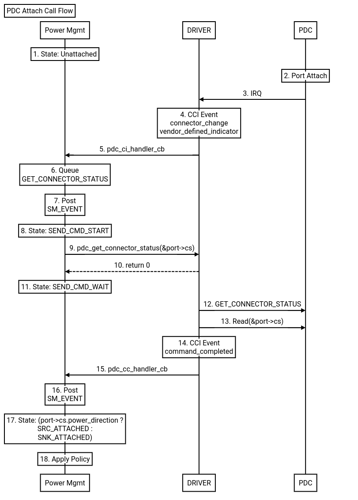

# Zephyr EC PDC Architecture

[TOC]

## Overview
TODO(b/384517822) - Document EC PDC Architecture

## PDC Console Commands
See [zephyr/subsys/pd_controller/pdc_console.c](https://chromium.googlesource.com/chromiumos/platform/ec/+/main/zephyr/subsys/pd_controller/pdc_console.c)

## PDC Driver API
See [zephyr/include/drivers/pdc.h](https://chromium.googlesource.com/chromiumos/platform/ec/+/main/zephyr/include/drivers/pdc.h)

### Supported drivers
See [zephyr/drivers/usbc/](https://chromium.googlesource.com/chromiumos/platform/ec/+/main/zephyr/drivers/usbc/)

## Power Management
[zephyr/subsys/pd_controller/pdc_power_mgmt.c](https://chromium.googlesource.com/chromiumos/platform/ec/+/main/zephyr/subsys/pd_controller/pdc_power_mgmt.c)

### State Machine Diagram

## Call Flows

### PDC Attach Sequence
A generic call flow for when a device is plugged into PDC port to illustrate
the communication between PDC, DRIVER, and Power Management modules.

*Note: Between step 9 and 13, the connector status is NOT valid yet, as the driver
 has not populated the structure until step 13.  Power Mgmt is not informed of this
 until step 15.*

### PDC Public Request
A generic call flow for when console or host requests are made to PDC Power Management.

*Note: Public requests are handled after policies have been applied and completed!*

