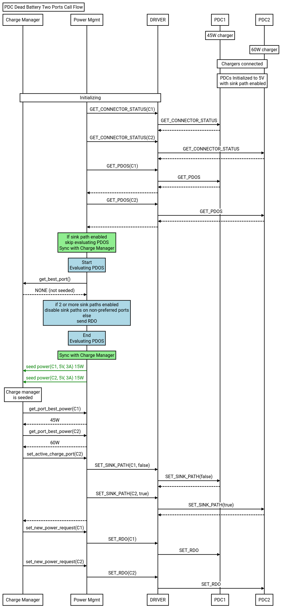

# PDC Dead Battery Handling

[Return to PDC documentation](../pdc.md)

Upon initialization in dead battery scenarios, the PDC only negotiates 5V. This
protects the system from reverse current appearing on Type-C chargers when two
or more chargers are connected.  When EC selects the "best" charger in dead
battery scenarios, EC needs to disable sink paths on the non-preferred chargers
first to prevent reverse current before requesting more power from the "best" charger.
This is illustrated in the call flow below.

Dead battery scenarios the EC handles

 Num PDC ports sinking | Battery status | Expectation
 :--------------------:| :------------: | :----------
 `1`                   |  Present       | Select the best PDO available from charger.  Depending on battery level, the AP may boot before or after picking best PDO (see [low battery startup](../../low_battery_startup.md) for details on AP boot conditions).
 `1`                   |  Not present   | The end result is effectively the same as the first case, because the charge manager will prevent AP from booting with the 5V PDO. This allows PDC subsystem to still select the best PDO and then we can boot the AP. The AP will boot after the best PDO selected.
 `> 1`                 |  Present       | First, charging is disabled on all but 1 port. Then the PDC subsys selects the best PDO for the selected port.  The AP is permitted to boot immediately, while the best PDO logic runs.
 `> 1`                 |  Not present   | Similar to previous case, but AP boot is delayed.
